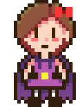
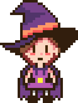
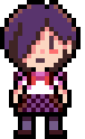
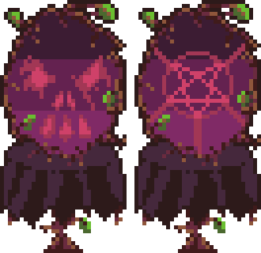
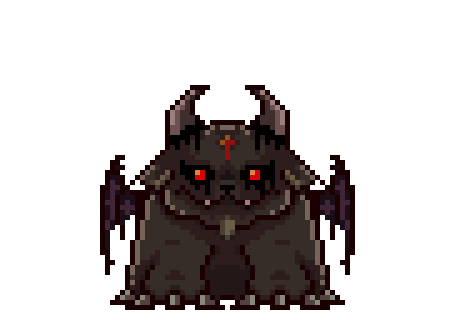

# Play with Satan
My personal game project

This is a demo I did for learning, I will continue the project in a new version of Unity reusing all the desings of this project, I´m still planning the game mechanics.
I made all the sprites in aseprite and also the functionalitie of the game. I´m thinking on a better name for the game, maybe I will choose a friendlier one, this is too dark haha.

## Content

- [Mechacnics](#mechacnics)
- [Design](#design)
    - [Protagonist](#protagonist)
    - [Secundary characters](#secundary-characters)
    - [Objects and room](#objects-and-room)
    - [Map of the house](#map-of-the-house)
- [Posible characters](#posible-characters)

## Mechacnics
The basic idea is that it be an open world game where the protagonist must go through cursed places and corners to collect objects that will serve her to reach her final goal.
What is the final goal? well, that's still a mystery.

## Design

### Protagonist
I was inspired by games like Earthbound and Yume Nikki, I made different designs for the protagonist, the third one is the one I liked the most, the idea is that the character has an inventory, so the backpack is a good additive to justify where she carries her objects.

  

### Secundary characters
The idea of the mirror is that the protagonist can talk to him to receive advice or teleport to other worlds, the mirror is alive and has its own personality, he is not very friendly so to get his help the protagonist needs to give him something in return.

A generic demon is the first "paranormal" interaction with the protagonist, it's scary but not so dangerous.

### Objects and room

### Map of the house

## Posible characters

